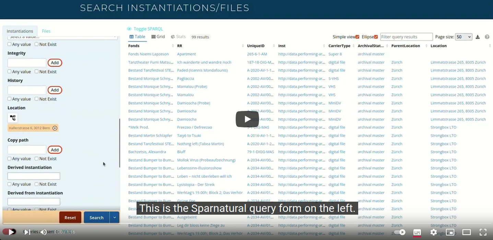

# Sparnatural-form

## Description

Sparnatural-form is a simpler, facet-like, user-oriented search UI component, that generates SPARQL queries based on a [Sparnatural](https://github.com/sparna-git/Sparnatural) configuration. The [available search widgets](https://docs.sparnatural.eu/widgets.html) are the same as in Sparnatural (dropdown lists, autocompletion search, tree, map, booleans, date, search etc.).
Sparnatural-form is meant to be a simple front-end for non-technical users that needs to query an RDF triplestore without worrying about the underlying data structure.

## User Features

- Simple easy-to-use vertical query form
- All Sparnatural widgets available : dropdown lists, autocomplete search fields, date calendars, tree, map, boolean, string search, numeric search
- Fetches automatically some columns to be displayed in the result table
- Ability to set a negation, or to check for the existence of each criteria
- Can trigger either a query for onscreen display with some columns, or for CSV export with more columns
- Different entities can be queried with forms in multiple tabs

## Configuration features

- Based on the same SHACL configuration file as Sparnatural
- Configurable using JSON config file that specifies the field to be presented to the user, their labels and description, and how they map to the underlying query. See the [form specification documentation](https://docs.sparnatural.eu/sparnatural-form/form-configuration.html)
- Can be integrated with the [same query result display plugins](https://github.com/sparna-git/sparnatural-yasgui-plugins) as with Sparnatural
- Packaged as a web component : `<sparnatural-form src="..." />`. See the [technical integration documentation](https://docs.sparnatural.eu/sparnatural-form/form-integration.html).
- Colors can be customized with the same theme CSS as Sparnatural

## What it looks like

Watch this 1:00 screencast to see how Sparnatural-form looks like:

## Getting started

1. Go to the latest release in the [release section](https://github.com/sparna-git/Sparnatural-form/releases)
2. Download the `hello-sparnatural-form.zip` and unzip it
3. Look at how the index.html looks like
4. Go to the [Sparnatural-form section of the documentation portal](https://docs.sparnatural.eu/#sparnatural-form) to understand how this is integrated
5. The SHACL configuration features are the same as Sparnatural and documented in the [_"How-to configure"_ section of Sparnatural doc](https://docs.sparnatural.eu/how-to-configure-shacl/How-to-configure-Sparnatural-shacl.html)
